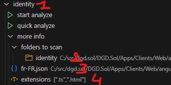

**Compile the source code :**

- npm i
- vsce package
---
**install the .vsix extension :**

- extensions (ctrl-shift-x)
- ... (top right corner) > install from VSIX
---
**config.json :**

    {
	    "utdConfig": [
		    {
			    "labelName": "example",
			    "rootPaths": ["C:/path/to/project/folder1", "C:/path/to/project/folder2"],
			    "jsonPath": "C:/path/to/your/file.json",
			    "excludePath": "C:/path/to/your/utd.exclude.txt",
			    "fileToAnalyze": [".ts", ".html"]
		    }
	    ],
	    "globalConfig": [
		    {
			    "outputFolder": ""
		    }
	    ]
    }
---

|key|required|description
|--|--|--|
|utdConfig|Can contain 0 project|Array of analyze configuration. can contain as many configuration as you want|
|labelName (1)|no|Name displayed of the analyze configuration|
|rootPath (2)|At least 1 path per configuration|Array of paths to be analyzed. It can contain as many path as you want|
|excludePath|no|Path to the file containing all the excluded json keys|
|fileToAnalyze|At least 1 per configuration|Array of extensions file to be analyzed|
|---|---|---|
|globalConfig|no|Array containing all extension configurations|
|outputFolder|no|Set the output folder where the output file will be generated|
---
